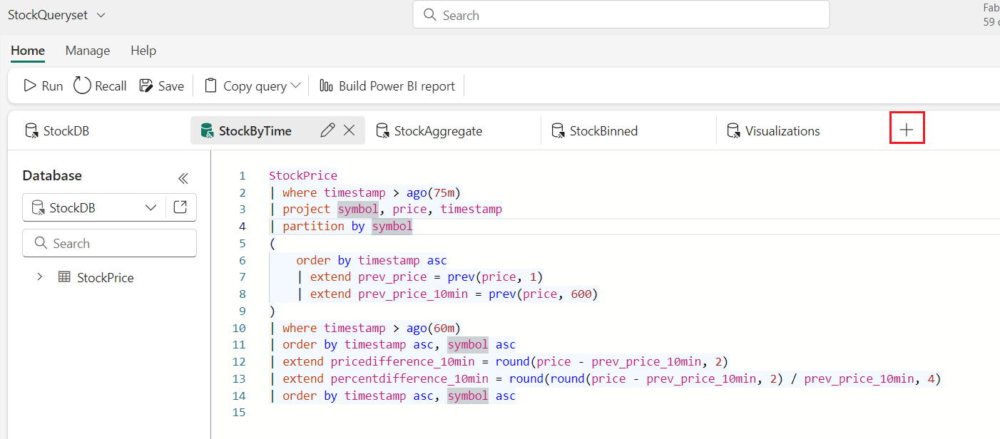

# **실습 07- Advanced KQL**
**소개**

이 실습에서는 추가적인 KQL 개념을 살펴봅니다.

**목표**

- 원본 KQL 쿼리의 구조와 실행을 검사하려면 scan operator를 활용하고,
  scan operator를 사용하여 데이터 마이닝을 수행하기

- 데이터를 더 넓은 그룹으로 집계하기 위한 bin function의 적용을 살펴보기

- 시간 간격에 따른 rallies를 검사하기 위해 bin과 scan operator를
  결합하기

## 작업 1: 원본 쿼리 검토

1.  왼쪽 탐색 메뉴에서 **RealTimeWorkspace** 작업 공간을 클릭하세요.

      

2.  **RealTimeWorkspace** 창에서 KQL 쿼리세트 유형의 Stock**Queryset을**
    선택하세요.

> 
>
> 

3.  원본 **StockByTime** 쿼리를 불러와서 쿼리를 선택한 다음 **Run**
    버튼을 클릭하여 쿼리를 실행하세요. 쿼리가 성공적으로 실행되면 결과를
    볼 수 있습니다.

StockPrice

| where timestamp \> ago(75m)

| project symbol, price, timestamp

| partition by symbol

(

order by timestamp asc

| extend prev_price = prev(price, 1)

| extend prev_price_10min = prev(price, 600)

)

| where timestamp \> ago(60m)

| order by timestamp asc, symbol asc

| extend pricedifference_10min = round(price - prev_price_10min, 2)

| extend percentdifference_10min = round(round(price - prev_price_10min,
2) / prev_price_10min, 4)

| order by timestamp asc, symbol asc

4.  이 쿼리는 파티셔닝과 이전 함수를 모두 활용합니다. 이전 함수가 동일한
    기호와 일치하는 행만 고려하도록 데이터가 파티셔닝됩니다.

> 

## 작업 2: scan operator 사용

우리가 사용하고자 하는 많은 쿼리에는 집계 또는 이전 값의 형태로 추가
정보가 필요합니다. SQL에서 집계는 종종 *그룹별로* 수행되고 조회는
*상관관계가 있는 subquery를* 통해 수행된다는 것을 기억하실 것입니다.
KQL에는 직접적으로 상관 관계 하위 쿼리가 없지만 다행히도 여러 가지
방법으로 이를 처리할 수 있으며, 이 경우 가장 유연한 방법은
[파티션](https://learn.microsoft.com/en-us/azure/data-explorer/kusto/query/partitionoperator)
문과 [scan
operator를](https://learn.microsoft.com/en-us/azure/data-explorer/kusto/query/scan-operator)
조합하여 사용하는 것입니다.

앞서 살펴본 것처럼 partition operator는 지정된 키를 기반으로 하위
테이블을 생성하고, scan operator는 지정된 술어에 따라 레코드를
일치시킵니다. 매우 간단한 규칙(각 기호가 이전 행과 일치함)만 있으면
되지만, scan operator는 이러한 단계와 술어를 연결할 수 있으므로 매우
강력할 수 있습니다.

1.  다음 KQL 쿼리는 prev() 함수를 사용하는 이전 KQL 쿼리와 유사한 결과를
    제공합니다:

2.  창 상단 근처의 ***+* 아이콘을** 클릭하여 쿼리세트 내에 새 탭을
    만드세요.

3.  Query editor에서 다음 코드를 복사하여 붙여넣으세요. **Run** 버튼을
    클릭하여 쿼리를 실행하세요.

복사

StockPrice

| where timestamp \> ago(60m)

| project timestamp, price, symbol

,previousprice = 0.00

,pricedifference = 0.00

,percentdifference = 0.00

| partition hint.strategy=native by symbol

(

order by timestamp asc

| scan with (step s: true =\> previousprice = s.price;)

)

| project timestamp, symbol, price, previousprice

,pricedifference = round((price-previousprice),2)

,percentdifference = round((price-previousprice)/previousprice,4)

| order by timestamp asc, symbol asc

4.  이 쿼리는 원래 쿼리와 구조가 비슷하지만, 분할된 데이터의 이전 행을
    보기 위해 prev() 함수를 사용하는 대신 scan operator가 이전 행을
    scan할 수 있다는 점이 다릅니다.

## 작업 3: scan을 통한 Data mining

Scan operator는 지정된 술어와 일치하는 행을 scan하는 단계를 얼마든지
포함할 수 있습니다. 이러한 단계는 이전 단계에서 학습한 상태를 서로
연결할 수 있다는 사실에서 그 위력을 발휘합니다. 이를 통해 데이터에 대한
프로세스 mining을 수행할 수 있습니다;

예를 들어 주가가 지속적으로 상승하는 stock rallies를 찾고자 한다고
가정해 보겠습니다. 가격은 단기간에 큰 폭으로 상승했을 수도 있고, 오랜
기간에 걸쳐 서서히 상승했을 수도 있습니다. 가격이 계속 상승하는 한
이러한 Rally를 살펴보고자 합니다.

1.  위의 예시를 바탕으로 먼저 prev() 함수를 사용하여 이전 주가를
    가져옵니다. scan operator를 사용하여 첫 번째 단계(*s1*)에서는 이전
    가격에서 상승한 가격을 찾습니다. 이 단계는 가격이 상승하는 한
    계속됩니다. 주가가 하락하면 *s2* 단계에서 *하락* 변수를 flag
    down하여 기본적으로 상태를 초기화하고 rally를 종료합니다:

2.  창 상단 근처의 ***+* 아이콘을** 클릭하여 쿼리세트 내에 새 탭을
    만드세요.

3.  Query editor에서 다음 코드를 복사하여 붙여넣으세요. **Run** 버튼을
    클릭하여 쿼리를 실행하세요.

**복사**

> StockPrice
>
> | project symbol, price, timestamp
>
> | partition by symbol
>
> (
>
> order by timestamp asc
>
> | extend prev_timestamp=prev(timestamp), prev_price=prev(price)
>
> | extend delta = round(price - prev_price,2)
>
> | scan with_match_id=m_id declare(down:bool=false, step:string) with
>
> (
>
> // if state of s1 is empty we require price increase, else continue as
> long as price doesn't decrease
>
> step s1: delta \>= 0.0 and (delta \> 0.0 or isnotnull(s1.delta)) =\>
> step = 's1';
>
> // exit the 'rally' when price decrease, also forcing a single match
>
> step s2: delta \< 0.0 and s2.down == false =\> down = true, step =
> 's2';
>
> )
>
> )
>
> | where step == 's1' // select only records with price increase
>
> | summarize
>
> (start_timestamp, start_price)=arg_min(prev_timestamp, prev_price),
>
> (end_timestamp, end_price)=arg_max(timestamp, price),
>
> run_length=count(), total_delta=round(sum(delta),2) by symbol, m_id
>
> | extend delta_pct = round(total_delta\*100.0/start_price,4)
>
> | extend run_duration_s = datetime_diff('second', end_timestamp,
> start_timestamp)
>
> | summarize arg_max(delta_pct, \*) by symbol
>
> | project symbol, start_timestamp, start_price, end_timestamp,
> end_price,
>
> total_delta, delta_pct, run_duration_s, run_length
>
> | order by delta_pct
>
> 
>
> 

4.  위의 결과는 길이에 관계없이 Rally에서 가장 큰 상승률을 찾습니다.
    가장 긴 Rally를 보고 싶다면 요약을 변경하면 됩니다:

5.  아래 이미지와 같이 ***+* 아이콘을** 클릭하여 쿼리세트 내에 새 탭을
    만드세요.

6.  Query editor에서 다음 코드를 복사하여 붙여넣으세요. **Run** 버튼을
    선택하여 쿼리를 실행하세요.

> **복사**
>
> StockPrice
>
> | project symbol, price, timestamp
>
> | partition by symbol
>
> (
>
> order by timestamp asc
>
> | extend prev_timestamp=prev(timestamp), prev_price=prev(price)
>
> | extend delta = round(price - prev_price,2)
>
> | scan with_match_id=m_id declare(down:bool=false, step:string) with
>
> (
>
> // if state of s1 is empty we require price increase, else continue as
> long as price doesn't decrease
>
> step s1: delta \>= 0.0 and (delta \> 0.0 or isnotnull(s1.delta)) =\>
> step = 's1';
>
> // exit the 'rally' when price decrease, also forcing a single match
>
> step s2: delta \< 0.0 and s2.down == false =\> down = true, step =
> 's2';
>
> )
>
> )
>
> | where step == 's1' // select only records with price increase
>
> | summarize
>
> (start_timestamp, start_price)=arg_min(prev_timestamp, prev_price),
>
> (end_timestamp, end_price)=arg_max(timestamp, price),
>
> run_length=count(), total_delta=round(sum(delta),2) by symbol, m_id
>
> | extend delta_pct = round(total_delta\*100.0/start_price,4)
>
> | extend run_duration_s = datetime_diff('second', end_timestamp,
> start_timestamp)
>
> | summarize arg_max(run_duration_s, \*) by symbol
>
> | project symbol, start_timestamp, start_price, end_timestamp,
> end_price,
>
> total_delta, delta_pct, run_duration_s, run_length
>
> | order by run_duration_s
>
> 

## 작업 4: 믹스에 Bin을 추가하기

이 작업에서는 기본적인 KQL 집계 문인 [Bin
함수에](https://learn.microsoft.com/en-us/azure/data-explorer/kusto/query/binfunction)
대해 자세히 살펴보겠습니다. Bin 함수를 사용하면 Bin 매개변수에 지정된
대로 지정된 크기의 그룹을 만들 수 있습니다. 이 함수는 *날짜 시간* 및
*기간* 유형에서 특히 강력하며, 이를 *요약* operator와 결합하여 데이터에
대한 더 광범위한 보기를 만들 수 있기 때문입니다.

1.  예를 들어, 주식 데이터는 초 단위의 정밀도를 가지고 있는데, 실시간
    대시보드에는 유용하지만 대부분의 보고서에는 너무 많은 데이터가
    필요합니다. 이 데이터를 일, 시간 또는 분과 같은 더 넓은 그룹으로
    집계하고 싶다고 가정해 보겠습니다. 또한 각 날짜의 마지막 가격(이
    데이터의 경우 23:59:59)이 "종가"로 사용된다고 가정해 보겠습니다.

2.  각 날짜의 종가를 얻으려면 이전 쿼리를 기반으로 하여 Bin을 추가하면
    됩니다.

3.  창 상단 근처의 ***+* 아이콘을** 클릭하여 쿼리세트 내에 새 탭을
    만드세요.

4.  Query editor에서 다음 코드를 복사하여 붙여넣으세요. **Run** 버튼을
    선택하여 쿼리를 실행하세요.

**복사**

> StockPrice
>
> | summarize arg_max(timestamp,\*) by bin(timestamp, 1d), symbol
>
> | project symbol, price, timestamp
>
> ,previousprice = 0.00
>
> ,pricedifference = 0.00
>
> ,percentdifference = 0.00
>
> | partition hint.strategy=native by symbol
>
> (
>
> order by timestamp asc
>
> | scan with (step s output=all: true =\> previousprice = s.price;)
>
> )
>
> | project timestamp, symbol, price, previousprice
>
> ,pricedifference = round((price-previousprice),2)
>
> ,percentdifference = round((price-previousprice)/previousprice,4)
>
> | order by timestamp asc, symbol asc

5.  이 쿼리는 *요약* 및 *Bin* 문을 활용하여 데이터를 일별 및 기호별로
    그룹화합니다. 결과는 각 주가의 일별 종가입니다. 필요에 따라
    최소/최대/평균 가격을 추가하고 필요에 따라 bin 시간을 변경할 수도
    있습니다.

## 작업 5: Bin과 Scan 결합

1.  초 단위로 Rally를 살펴보는 것은 수명이 짧은 데이터에 적합하지만,
    현실적이지 않을 수도 있습니다. Rally 쿼리를 Bin과 결합하여 데이터를
    더 긴 기간으로 버킷화하면 원하는 기간 동안의 Rally를 찾을 수
    있습니다.

2.  **+아이콘을** 클릭하여 쿼리세트 내에 ***새*** 탭을 만드세요.

3.  Query editor에서 다음 코드를 복사하여 붙여넣으세요. **Run** 버튼을
    클릭하여 쿼리를 실행하세요.

**복사**

StockPrice

| summarize arg_max(timestamp,\*) by bin(timestamp, 1m), symbol

| project symbol, price, timestamp

| partition by symbol

(

order by timestamp asc

| extend prev_timestamp=prev(timestamp), prev_price=prev(price)

| extend delta = round(price - prev_price,2)

| scan with_match_id=m_id declare(down:bool=false, step:string) with

(

// if state of s1 is empty we require price increase, else continue as
long as price doesn't decrease

step s1: delta \>= 0.0 and (delta \> 0.0 or isnotnull(s1.delta)) =\>
step = 's1';

// exit the 'rally' when price decrease, also forcing a single match

step s2: delta \< 0.0 and s2.down == false =\> down = true, step = 's2';

)

)

| where step == 's1' // select only records with price increase

| summarize

(start_timestamp, start_price)=arg_min(prev_timestamp, prev_price),

(end_timestamp, end_price)=arg_max(timestamp, price),

run_length=count(), total_delta=round(sum(delta),2) by symbol, m_id

| extend delta_pct = round(total_delta\*100.0/start_price,4)

| extend run_duration_s = datetime_diff('second', end_timestamp,
start_timestamp)

| summarize arg_max(delta_pct, \*) by symbol

| project symbol, start_timestamp, start_price, end_timestamp,
end_price,

total_delta, delta_pct, run_duration_s, run_length

| order by delta_pct

## **요약**

이 실습에서는 주가 데이터 분석을 위한 고급 기법을 중심으로
RealTimeWorkspace 환경 내에서 KQL(Kusto Query Language) 사용에 대한
이해와 숙련도를 높이는 것을 목표로 합니다.

이 실습에서는 파티셔닝과 이전 함수를 사용하여 시간 경과에 따른 주가를
분석하는 원래 StockByTime 쿼리를 실행했습니다. 그런 다음 prev() 함수의
대안으로 scan operator를 사용했습니다. scan operator를 사용하여 Data
mining을 수행하여 주식 Rally를 식별하고 데이터에서 특정 패턴을 감지하는
유연성을 보여주었습니다.

기본 KQL 집계 문인 Bin 함수를 사용하여 지정된 시간 간격을 기준으로 주식
데이터를 더 넓은 그룹으로 집계하는 방법을 살펴보았습니다. 그런 다음, Bin
operator와 scan operator를 결합하여 데이터를 더 긴 기간으로 버킷화하여
원하는 기간 동안의 Rally를 쉽게 식별할 수 있도록 했습니다. 여러 KQL
operator를 결합하여 주가 데이터 세트에 대한 종합적인 분석 작업을
수행하는 실무 경험을 쌓았습니다.
