# Lab 07-Advanced KQL
**Introduction**

In this lab, you’ll explore additional KQL concepts.

**Objectives**

- To examine the structure and execution of an original KQL query,
  utilize the scan operator, and perform data mining using the scan
  operator.

- To explore the application of the bin function for aggregating data
  into broader groups.

- To combine the bin and scan operators for examining rallies over any
  interval of time.

## Task 1: Examine the original query

1.  Click on **RealTimeWorkspace** Workspace on the left-sided
    navigation menu.
     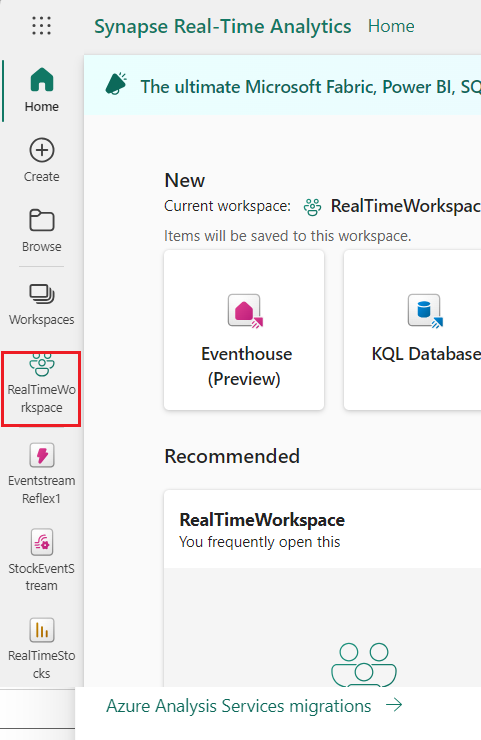

2.  In the **RealTimeWorkspace** pane, select **StockQueryset** of KQL
    Queryset type.
     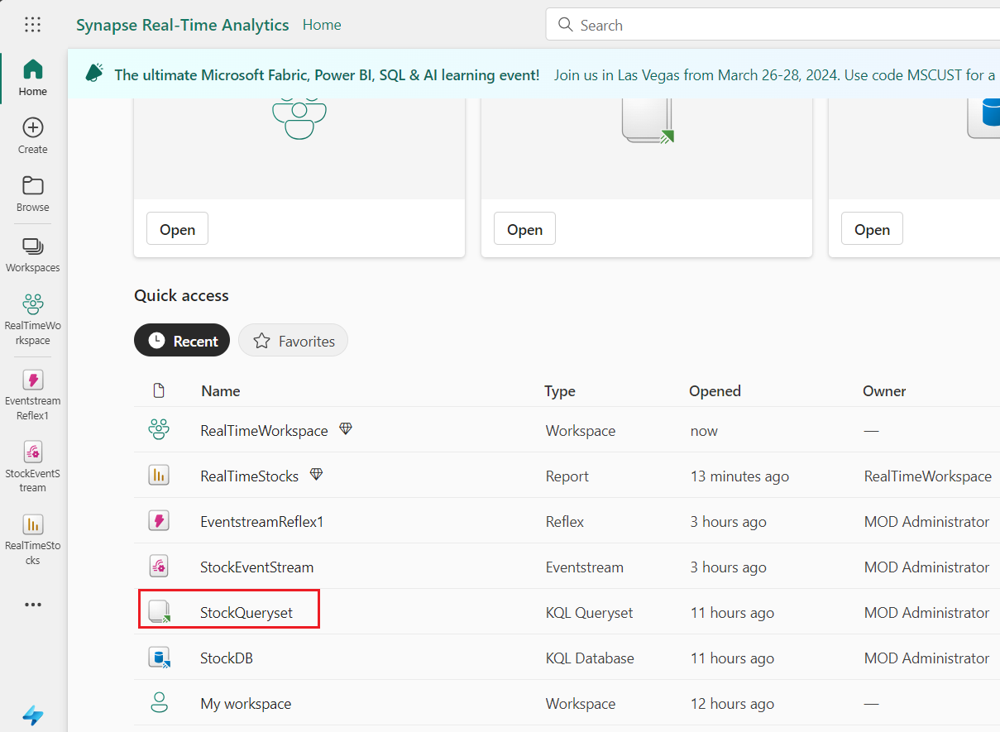
     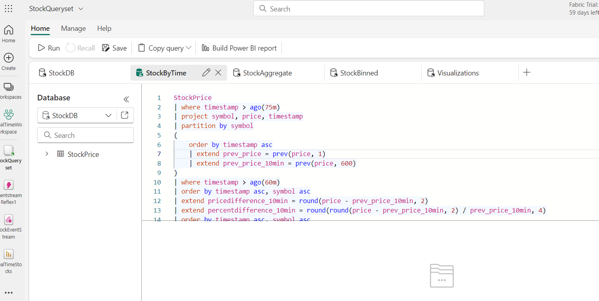

3.  Recall the original **StockByTime** query, select the query and
    click on the **Run** button to execute the query. After the query is
    successfully executed, you will see the results.
```
StockPrice
| where timestamp > ago(75m)
| project symbol, price, timestamp
| partition by symbol
(
    order by timestamp asc
    | extend prev_price = prev(price, 1)
    | extend prev_price_10min = prev(price, 600)
)
| where timestamp > ago(60m)
| order by timestamp asc, symbol asc
| extend pricedifference_10min = round(price - prev_price_10min, 2)
| extend percentdifference_10min = round(round(price - prev_price_10min, 2) / prev_price_10min, 4)
| order by timestamp asc, symbol asc
```
  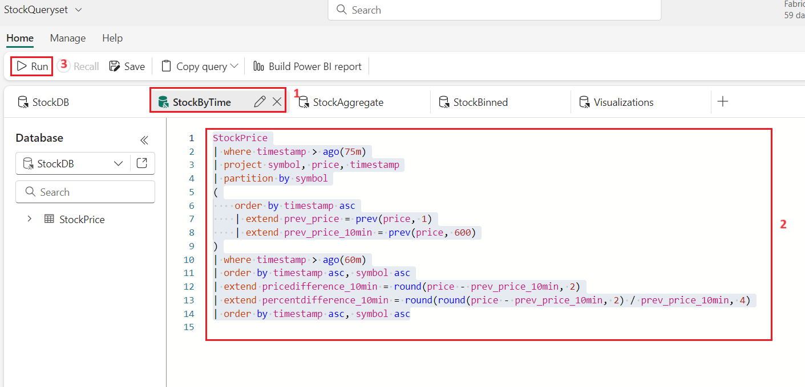
4.  This query takes advantage of both partitioning and previous
    functions. The data is partitioned to ensure that the previous
    function only considers rows matching the same symbol.
     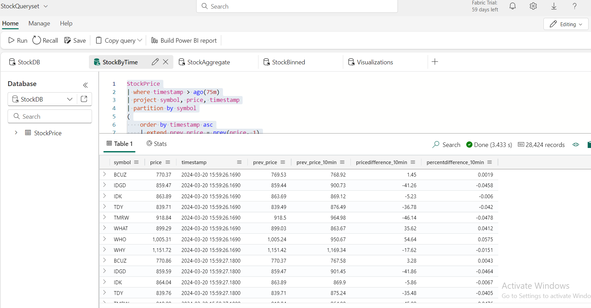

## Task 2: Using the scan operator

Many of the queries we'd like to use need additional information in the
form of aggregations or previous values. In SQL, you might recall that
aggregations are often done via *group by*, and lookups can be done via
a *correlated subquery*. KQL doesn't have correlated subqueries
directly, but fortunately can handle this several ways, and the most
flexible in this case is using a combination of the [partition
statement](https://learn.microsoft.com/en-us/azure/data-explorer/kusto/query/partitionoperator) and
the [scan
operator](https://learn.microsoft.com/en-us/azure/data-explorer/kusto/query/scan-operator).

The partition operator, as we've seen, creates subtables based on the
specified key, while the scan operator matches records according to
specified predicates. While we only need a very simple rule (match the
previous row for each symbol), the scan operator can be very powerful as
these steps and predicates can be chained.

1.  Consider the following KQL query, which will give similar results as
    our previous KQL query that uses the prev() function:

2.  Create a new tab within the queryset by clicking the ***+* icon**
    near the top of the window.
     
3.  In the query editor, copy and paste the following code. Click on the
    **Run** button to execute the query.
```
StockPrice
| where timestamp > ago(60m)
| project timestamp, price, symbol
 ,previousprice = 0.00
 ,pricedifference = 0.00
 ,percentdifference = 0.00
| partition hint.strategy=native by symbol
  (
    order by timestamp asc 
    | scan with (step s: true => previousprice = s.price;)
  )
| project timestamp, symbol, price, previousprice
    ,pricedifference = round((price-previousprice),2)
    ,percentdifference = round((price-previousprice)/previousprice,4)
| order by timestamp asc, symbol asc
```
  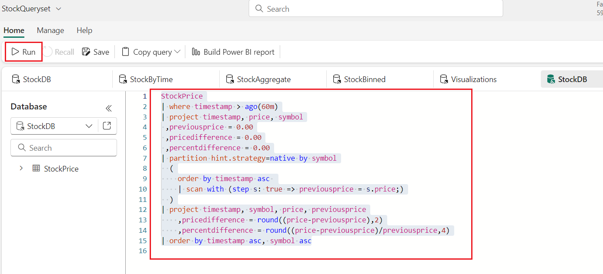

4.  This query is similar in structure to our original query, except
    instead of using the prev() function to look at the previous row of
    the partitioned data, the scan operator can scan the previous rows. 
      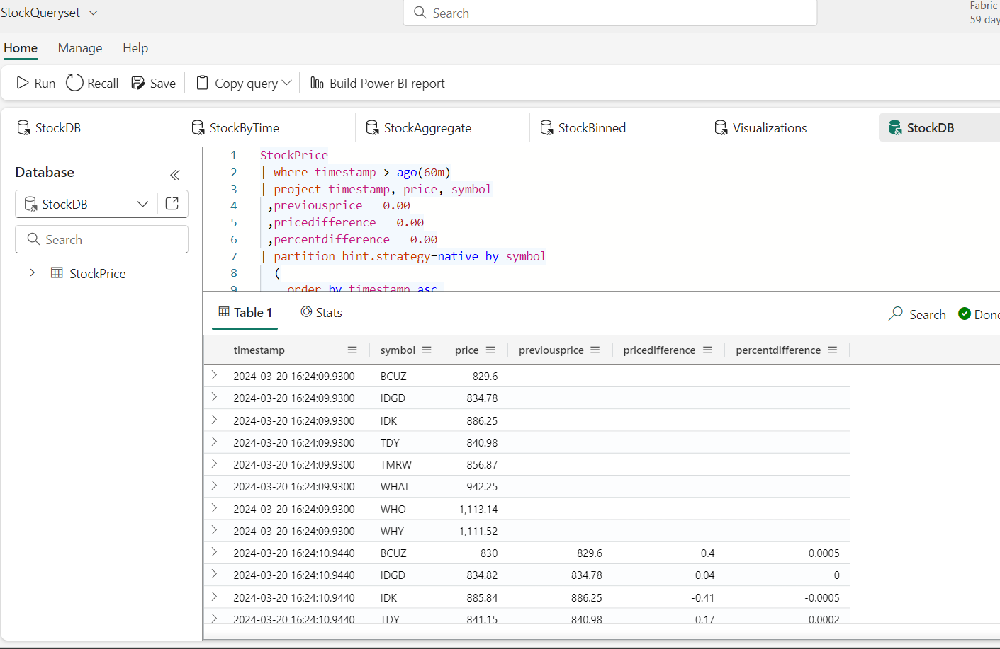

## Task 3: Mining the data with scan

The scan operator may contain any number of steps that scans rows
matching the specified predicates. The power comes from the fact that
these steps can chain together state learned from previous steps. This
allows us to do process mining on the data;

For example, suppose we'd like to find stock rallies: these occur when
there is a continuous increase in the stock price. It could be that the
price jumped a high amount over a short period of time, or it might be
the price slowly rose over a long period of time. As long as the price
keeps increasing, we'd like to examine these rallies.

1.  Building off the examples above, we first use the prev() function to
    get the previous stock price. Using the scan operator, the first
    step (*s1*) looks for an increase from the previous price. This
    continues as long as the price increases. If the stock decreases,
    the step *s2* flags the *down* variable, essentially resetting the
    state and ending the rally:

2.  Create a new tab within the queryset by clicking the ***+* icon**
    near the top of the window.
     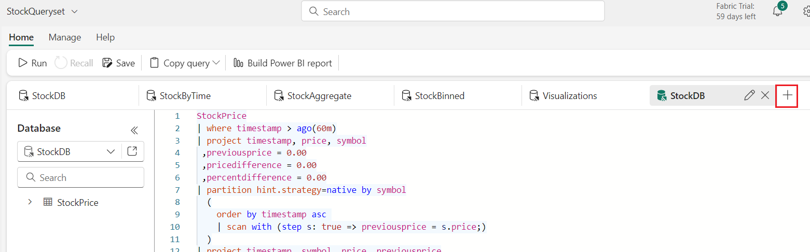
3.  In the query editor, copy and paste the following code. Click on
    the **Run** button to execute the query.
```
StockPrice
| project symbol, price, timestamp
| partition by symbol
(
    order by timestamp asc 
    | extend prev_timestamp=prev(timestamp), prev_price=prev(price)
    | extend delta = round(price - prev_price,2)
    | scan with_match_id=m_id declare(down:bool=false, step:string) with 
    (
        // if state of s1 is empty we require price increase, else continue as long as price doesn't decrease 
        step s1: delta >= 0.0 and (delta > 0.0 or isnotnull(s1.delta)) => step = 's1';
        // exit the 'rally' when price decrease, also forcing a single match 
        step s2: delta < 0.0 and s2.down == false => down = true, step = 's2';
    )
)
| where step == 's1' // select only records with price increase
| summarize 
    (start_timestamp, start_price)=arg_min(prev_timestamp, prev_price), 
    (end_timestamp, end_price)=arg_max(timestamp, price),
    run_length=count(), total_delta=round(sum(delta),2) by symbol, m_id
| extend delta_pct = round(total_delta*100.0/start_price,4)
| extend run_duration_s = datetime_diff('second', end_timestamp, start_timestamp)
| summarize arg_max(delta_pct, *) by symbol
| project symbol, start_timestamp, start_price, end_timestamp, end_price,
    total_delta, delta_pct, run_duration_s, run_length
| order by delta_pct
```
 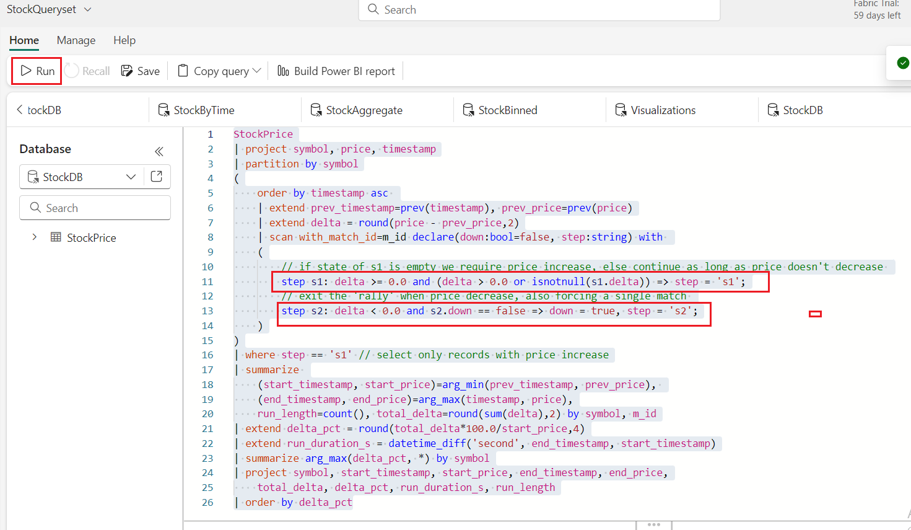
 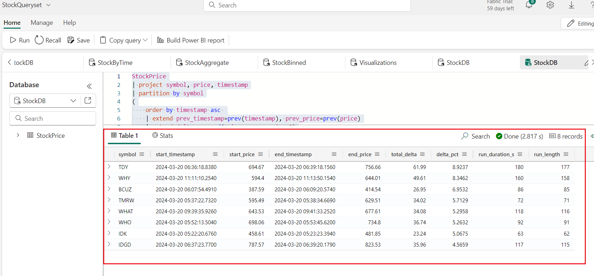

4.  The result above looks for the largest percentage gain in a rally,
    regardless of length. If we'd like to see the longest rally, we can
    change the summarization:

5.  Create a new tab within the queryset by clicking the ***+* icon** as
    shown in the below image.
     

6.  In the query editor, copy and paste the following code. Select
    the **Run** button to execute the query
```
StockPrice
| project symbol, price, timestamp
| partition by symbol
(
    order by timestamp asc 
    | extend prev_timestamp=prev(timestamp), prev_price=prev(price)
    | extend delta = round(price - prev_price,2)
    | scan with_match_id=m_id declare(down:bool=false, step:string) with 
    (
        // if state of s1 is empty we require price increase, else continue as long as price doesn't decrease 
        step s1: delta >= 0.0 and (delta > 0.0 or isnotnull(s1.delta)) => step = 's1';
        // exit the 'rally' when price decrease, also forcing a single match 
        step s2: delta < 0.0 and s2.down == false => down = true, step = 's2';
    )
)
| where step == 's1' // select only records with price increase
| summarize 
    (start_timestamp, start_price)=arg_min(prev_timestamp, prev_price), 
    (end_timestamp, end_price)=arg_max(timestamp, price),
    run_length=count(), total_delta=round(sum(delta),2) by symbol, m_id
| extend delta_pct = round(total_delta*100.0/start_price,4)
| extend run_duration_s = datetime_diff('second', end_timestamp, start_timestamp)
| summarize arg_max(run_duration_s, *) by symbol
| project symbol, start_timestamp, start_price, end_timestamp, end_price,
    total_delta, delta_pct, run_duration_s, run_length
| order by run_duration_s
```
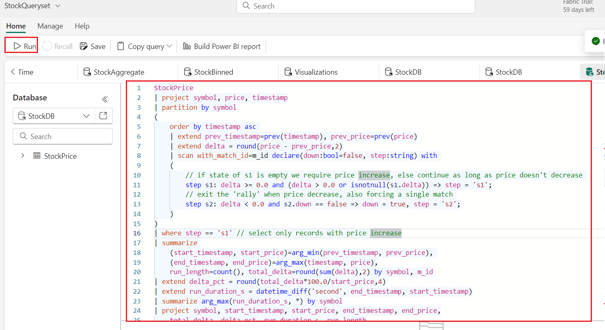
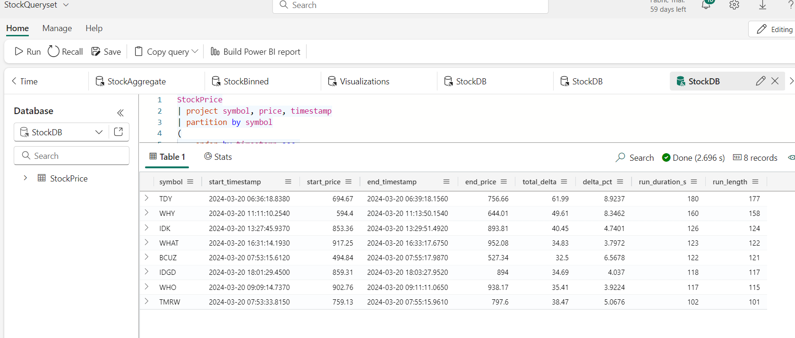
## Task 4: Adding bin to the mix

In this task, let's look more closely at a fundamental KQL aggregation
statement: [the bin
function](https://learn.microsoft.com/en-us/azure/data-explorer/kusto/query/binfunction).
The *bin* function allows us to create groups of a given size as
specified by the bin parameters. This is especially powerful
with *datetime* and *timespan* types, as we can combine this with
the *summarize* operator to create broader views of our data.

1.  For example, our stock data has per-second precision -- useful for
    our real-time dashboard but too much data for most reports. Suppose
    we'd like to aggregate this into broader groups, such as days,
    hours, or even minutes. Further, let's make an assumption that the
    last price on each day (likely 23:59:59 for our data) will serve as
    our "closing price."

2.  To get the closing price for each day, we can build off our previous
    queries and add a bin.

3.  Create a new tab within the queryset by clicking the ***+* icon**
    near the top of the window.
     

4.  In the query editor, copy and paste the following code. Select
    the **Run** button to execute the query
```
StockPrice
| summarize arg_max(timestamp,*) by bin(timestamp, 1d), symbol
| project symbol, price, timestamp
,previousprice = 0.00
,pricedifference = 0.00
,percentdifference = 0.00
| partition hint.strategy=native by symbol
  (
    order by timestamp asc 
    | scan with (step s output=all: true => previousprice = s.price;)
  )
| project timestamp, symbol, price, previousprice
    ,pricedifference = round((price-previousprice),2)
    ,percentdifference = round((price-previousprice)/previousprice,4)
| order by timestamp asc, symbol asc
```

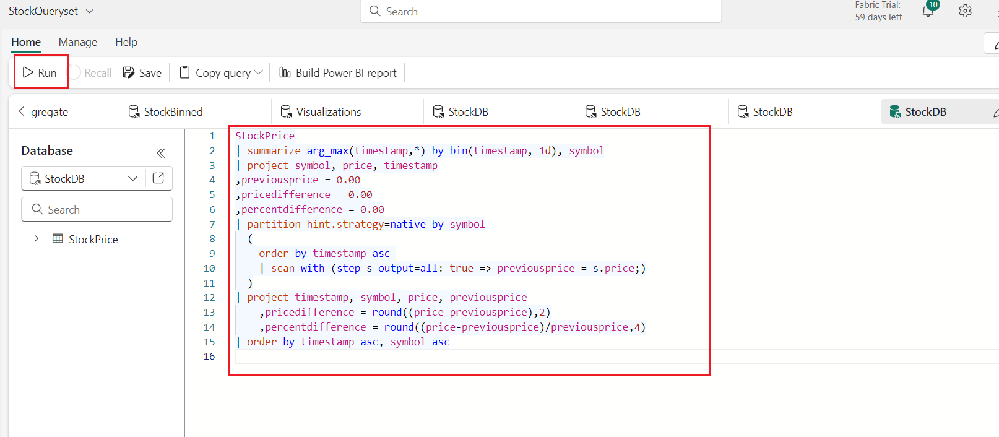

5.  This query leverages the *summarize* and *bin* statements to group
    the data by day and symbol. The result is the closing price for each
    stock price per day. We can also add min/max/avg prices as needed,
    and alter the binning time as needed.

     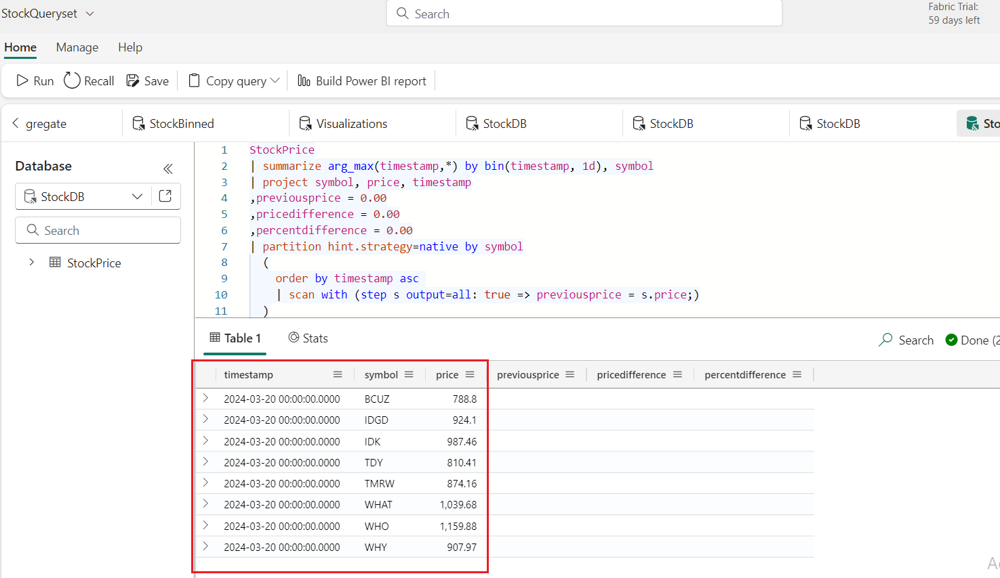

## Task 5:Combining bin and scan

1.  While looking at rallies on a per-second level is great for our
    short-lived data, it might not be too realistic. We can combine the
    rally query with the bin to bucketize data into longer periods of
    time, thus looking for rallies over any interval we'd like.

2.  Create a new tab within the queryset by clicking the ***+* icon**.

      

3.  In the query editor, copy and paste the following code. Click on
    the **Run** button to execute the query.
```
StockPrice
| summarize arg_max(timestamp,*) by bin(timestamp, 1m), symbol
| project symbol, price, timestamp
| partition by symbol
(
    order by timestamp asc 
    | extend prev_timestamp=prev(timestamp), prev_price=prev(price)
    | extend delta = round(price - prev_price,2)
    | scan with_match_id=m_id declare(down:bool=false, step:string) with 
    (
        // if state of s1 is empty we require price increase, else continue as long as price doesn't decrease 
        step s1: delta >= 0.0 and (delta > 0.0 or isnotnull(s1.delta)) => step = 's1';
        // exit the 'rally' when price decrease, also forcing a single match 
        step s2: delta < 0.0 and s2.down == false => down = true, step = 's2';
    )
)
| where step == 's1' // select only records with price increase
| summarize 
    (start_timestamp, start_price)=arg_min(prev_timestamp, prev_price), 
    (end_timestamp, end_price)=arg_max(timestamp, price),
    run_length=count(), total_delta=round(sum(delta),2) by symbol, m_id
| extend delta_pct = round(total_delta*100.0/start_price,4)
| extend run_duration_s = datetime_diff('second', end_timestamp, start_timestamp)
| summarize arg_max(delta_pct, *) by symbol
| project symbol, start_timestamp, start_price, end_timestamp, end_price,
    total_delta, delta_pct, run_duration_s, run_length
| order by delta_pct
```
  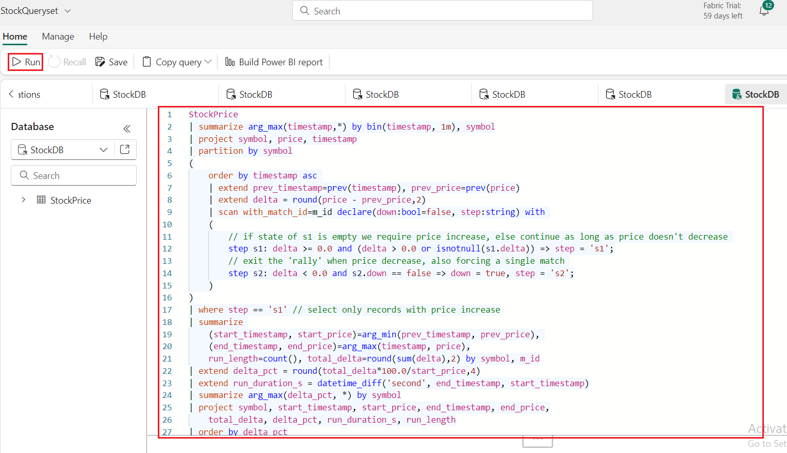
  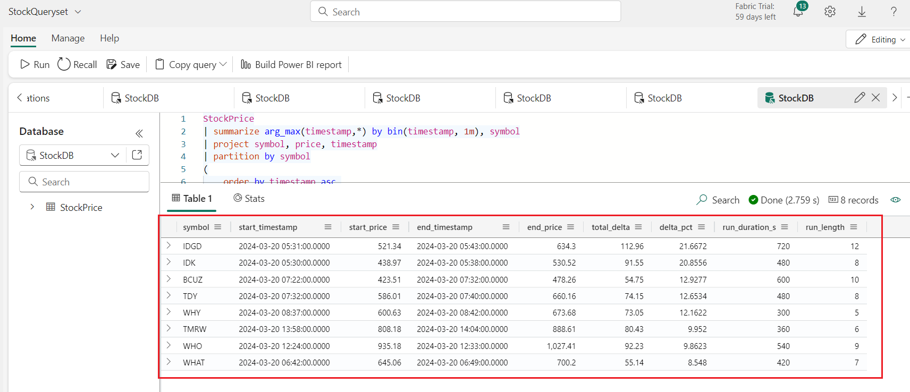
## **Summary**

This lab aims to enhance your understanding and proficiency in using
Kusto Query Language (KQL) within the RealTimeWorkspace environment,
focusing on advanced techniques for analyzing stock price data.

In this lab, you’ve executed the original StockByTime query, which
employs partitioning and previous functions to analyze stock prices over
time. Then, you’ve used the scan operator as an alternative to the
prev() function. You’ve performed data mining using the scan operator to
identify stock rallies, demonstrating its flexibility in detecting
specific patterns in the data.

You’ve explored the bin function, a fundamental KQL aggregation
statement, to aggregate stock data into broader groups based on
specified time intervals. Then, you’ve combined the bin and scan
operators to bucketize data into longer periods, facilitating the
identification of rallies over any desired interval. You’ve gained
practical experience in combining multiple KQL operators to conduct
comprehensive analysis tasks on stock price datasets.
